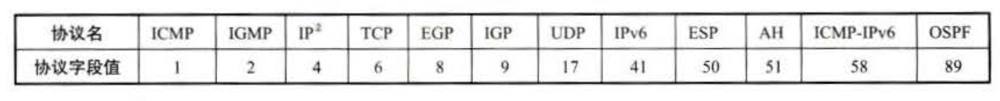
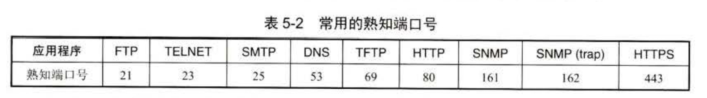

# 计算机网络笔记

***前三章笔记暂时不更新***

## 第1章 概述

## 第2章 物理层

## 第3章 数据链路层

## 第4章 网络层

### 网络层的几个重要概念

#### 提供的两种服务

1.虚电路（VC） ❌

2.网络层向上层只提供简单灵活的、无连接的、尽最大努力交付的（IP）数据报服务

网络层不提供服务质量的承诺

#### 网络层两个层面

1.数据层面（转发层面）

​	转发表

2.控制层面

​	路由选择算法

​	最近网络界提出的***软件定义网络***（SDN）正对两个层面进行重大改变，有一个逻辑上集中的 ***远程控制器*** 掌握各个主机和网络的状态，能够为每一个分组计算出最佳路由，然后在每一个路由器中生成其正确的转发表

### 网络协议IP

主要内容ARP、ICMP、IGMP

#### 虚拟互联网络

连接网络的中间设备：

​	（1）物理层用 ***转发器***

​	（2）数据链路层用 ***网桥/桥接器*** 和 ***交换机***

​	（3）网络层用 ***路由器***

​	（4）网络层以上用 ***网关***

由于互连的计算机网络都使用相同的网际协议（IP），因此可以把互连以后的计算机网络看成如图所示的一个 ***虚拟互连网络***

从源主机交付数据报到目的主机：

​	不需要经过任何路由器->***直接交付***

​	需要经过一个或几个路由器->***间接交付***

分组在传送途中每一次转发称为一“跳”（hop）

#### IP地址

##### IP地址及其表示方法

IP地址：32位二进制代码，为方便可读性每8位插入一个空格(机器里没有空格)为了方便人们书写和记忆用 ***点分十进制记法***（每段数字写成十进制，之间加小数点）

IP地址 ::={<网络号,<主机号>}            ::=表示“定义为”

##### 分类的IP地址

A、B、C地址都是 ***单播地址***	D是 ***多播地址*** 	E是 ***保留地址***

A类：网络号字段固定1位，剩下7位可供使用

​	其中7位全0用作表示“本网络”，7位全1（127）保留作为本地软件 ***环回测试*** 本主机的进程之间的通信之用

对于ABCDE的主机号部分：

​	全0主机号表示“本主机”连接到的***单个网络地址***

​	全1主机号表示“所有的”（广播）

所以各类网络最大主机数都是$2^n-2$（n为主机号位数）

##### 无分类编址 

编址方法全名 ***无分类域间路由选择（CIDR）***

（1）网络前缀

CIDR记法 	IP地址::={<网络前缀>,<主机号>}/n（前缀数）

（2）地址块

CIDR把网络前缀都相同的所有连续的IP地址组成一个“CIDR 地址块”

（3）地址掩码（子网掩码）

由n个1和（32-n)个0组成，n=前缀长度

 二进制IP地址与地址掩码进行按位与运算，得到网络地址

CIDR地址中有三个特殊地址块：

「1」前缀n=32 用于 ***主机路由***

「2」前缀n=31 主机号只有0和1，用于 ***点对点链路***

「3」前缀n=0 IP地址也是全0，用于 ***默认路由***

##### IP地址的特点

IP地址由网络前缀和主机号两部分组成

IP地址标志一台主机（或路由器）和一条链路的接口 

​	当一条主机连在两个网路上则需要两个对应的IP，网络前缀必须不同，这种称为 ***多归属主机***

一个网络（或子网）是指具有相同网络前缀的主机的集合，转发器和交换机连接起来的局域网仍然为一个网络

所有分配到网络前缀的网络都是平等的，互联网平等对待每一个IP地址

#### IP地址与MAC地址

IP地址是网络层及以上使用的逻辑地址

MAC地址是数据链路层使用的地址

#### 地址解析协议ARP

ARP作用： 在已知一个机器的IP地址情况下找出其MAC地址

主机的ARP高速缓存中会存放一个IP到MAC的映射表，映射表会动态更新（新增或超时删除）

​	因为有时候网络会更换主机，映射发生变化，所以需要一定时间删除

运行方法如下：

​	1.A要给B发IP数据报，在由映射表的情况下按表发送，映射表没B则到步骤2

​	2.在本局域网广播发送ARP请求分组

​	3.主机B发现ARP请求查询到IP和自己一致，收下ARP并向A发送ARP响应分组

​	4.自此A记录了B的映射，B记录了A的映射

​	5.该映射项目到设置的 ***生存时间*** 之后（一般10～20min）会被删除，然后重走1

如果目的主机不在源主机的局域网上，则ARP发给路由器，映射过程同上

#### IP数据报的格式

##### IP数据报首部固定部分

版本：有4和6

首部长度：占4位  表示单位为32位字长（1个32位字长4字节），最小值5（20字节固定首部长度）

​	注：IP首部必须为4字节整数倍，不满则会被填充

区分服务：一般不用

总长度： 首部和数据之和的长度 单位：字节 

​	占16位 所以数据报最大长度$2^{16} -1=65535$字节

​	数据链路层有数据部分最大传送单元MTU 1500字节，如果数据包超出则需要进行分片处理，每个分片都是首部+数据的形式

标识： 占16位 被分片后相同标识使之能重新组装

片转移： 占13位 记录每一片相对位置，以8字节位偏移单位，所以除了最后一个数据报片外每个分片的长度一定是8字节的整数倍

生存时间： 占8位，每一跳减1，到0数据报被丢弃

协议： 占8位

首部检验和：占16位	 这个字段只检验数据报的首部，不包括数据部分

​	将数据报首部每16位一组，每组不进位相加，得到16位结果再取反得到检验和

​	每经过一个路由器都重新计算

源地址：32位

目的地址：32位

##### 可变部分

选项字段，用来排错、测量及安全等措施

### IP层转发分组的过程

#### 基于终点的转发

分组在互联网上传送和转发是基于分组首部中的目的地址，所以称为基于终点的转发

这主要是一个 ***寻找前缀匹配*** 的过程

#### 最长前缀匹配

分组转发算法：（转发表按照前缀长短排列，长的在前）

​	1.从收到的分组提取目的主机IP地址D

​	2.若查找到有特定主机路由，按这条路由下一跳转发，否则到转发表下一行（前缀最长的一行）进行检查

​	3.将本行子网掩码与目的地址按位与运算

​		若与本行前缀匹配则查找结束，按照该下一跳处理

​		若不匹配，若有下一行则检查下一行，若没有则执行4

​	4.若转发表有一个默认路由，则按照指明的接口把分组传送到指明的默认路由器

#### 使用二叉线索查找转发表

找出对应每个IP地址的唯一前缀，然后按照唯一前缀构建0/1二叉树结构

### 网际控制报文协议ICMP

ICMP允许主机或路由器报告差错情况和提供有关异常的报告

ICMP装在IP数据报的数据部分

#### ICMP报文的种类

分两种：

​	差错报告报文

​	询问报文

差错报文：提取IP数据报的首部和数据字段前8个字节，在首部前面再加上ICMP差错报告报文的前8个字节，就构成了ICMP差错报告报文

不发送差错报告的情况

​	对ICMP差错报告报文不再发送差错报告报文

​	对第一个分片的数据报片的所有后续数据报片不发送

​	对多播数据报不发

​	对特殊地址数据报（eg. 127.0.0.0  0.0.0.0等）不发

#### 应用举例

略

### IPv6

#### 基本首部

IPv6地址从IPv4的32位增到128位。地址空间增大$2^{96}$倍 根本用不完！

空间大，地址层次划分可以更多

首部和IPv4不兼容，定义了许多可选扩展首部，灵活

改进的选项。IPv6允许数据报包含有选项的控制信息，可以包含一些新的选项，但是IPv6首部长度是固定的，选项放在有效载荷中

​	和4的区别，4的选项放在首部，是固定不变的

允许协议继续扩充

支持即插即用，不用DHCP

支持资源与分配

首部改为8字节对齐（IPV4是4字节对齐）

区别如下：

取消了首部长度字段，因为IPV6首部固定

取消服务类型字段

取消总长度字段，改用有效载荷长度字段

取消了标识、标志和片偏移字段，功能已包含在分片扩展首部中

TTL字段改为跳数限制字段，功能一样

取消了协议字段，该用下一首部字段

取消了检验和字段

取消了选项字段，用扩展首部来实现选项功能

#### IPv6地址

地址类型分三种：

- 单播
- 多播
- 任播 增加的一种类型，发给一组计算机，只交付给最近的那一台

为了使地址简洁，用16进制记法，每4个数一个冒号：隔开

***零压缩***：对于数字0可以省略，0000则保留一个0，如果是一连串的0则用一对冒号::取代

为防止歧义，任一地址中只能有一次零压缩

CIDR斜线记法类似，但是前缀最后一位0不能省略（eg 12AB::CD30/60)

​	注：IPv6取消了子网掩码

#### IPv4向IPv6过度

##### 双协议栈

完全过渡到IPv6之前，使一部分主机（或路由器）同时装有IPv4和IPv6两种协议栈。 代价大

##### 隧道技术

在IPv6数据报要进入IPv4网络时，把它封装为IPv4数据报

#### ICMPv6

ICMPv6合并了ARP、IGMP功能

### 互联网路由选择协议

#### 基本概念

1.理想的路由算法

- 必须完整且正确

- 应该简单

- 能适应通信量和网络拓扑的变化——自适应性

- 有稳定性

- 应公平

- 应是最佳的

2.分层次的路由选择协议

​	互联网规模很大，可以划分为多个较小的自治系统（AS）

​		内部网关协议：IGP -> RIP or OSPF

​		外部网关协议：EGP -> BGP-4

#### 内部网关协议RIP

1.工作原理

​	RIP要求网络中每一个路由器维护从它自己到其他每一个目的网络的距离记录，直连定义为1，从一主机到非直接连接到网络的距离定义为所经过的路由器 +1 。

​	RIP的距离即“跳数”，RIP允许一条路径最多包含15个网络，因此距离为16时相当于不可达。所以 ***RIP只适用于小型互联网***。

​	关于RIP特点：

-  仅和相邻路由器交换信息
- 交换所知全部信息，即当前路由表
- 按固定时间间隔交换信息

最开始路由表为空，路由器先得出相邻距离为1，后面多轮交换后路由表逐渐收敛

2.距离向量算法

对 ***每一个相邻路由器*** 发送的RIP报文执行以下步骤：

（1）对地址为X的相邻路由器发来的RIP报文，先修改此报文中的 ***所有项目*** ：把“下一跳”字段的地址都改为X，所有“距离”字段值加1。

每一个项目都有三个关键数据：到目的网络Net，距离d，下一跳路由器是X

（2）对修改的RIP报文每一个项目进行如下步骤：

​	若原来路由表中没有目的网络Net，则把该项目添加到路由表

​	否则（即在路由表中有目的网络Net，这时就再查看下一跳路由器地址）

​		若下一跳地址是X，就把收到的项目替换原路由表中的项目

​		否则（即这个项目是：到目的网络Net但是下一跳路由器不是X）

​			若收到的项目等距离d小于路由表中的距离则进行更新

​			否则什么也不做

（3）若三分钟没收到相邻路由器的更新路由表，就把此相邻路由器距离设置为16（不可达）

（4）返回

#### 内部网关协议OSPF

1.基本特点

​	OSPF：开放最短路径优先

​	为了克服RIP缺点，使用Dijkstra算法，RIP以跳数测距，OSPF以传输速率测距

​	OSPF协议下，向本自治系统总所有路由器发送信息，使用 *** 洪泛法*** ，路由器通过所有输出端口向相邻路由器发信息，每个相邻路由器再将此信息发往其所有相邻路由器（但不发给传入信息的那个路由器），最终使得整个区域路由器都得到一个信息副本。

​	链路状态发生变化或每隔一段时间路由器就会用洪泛法发送链路状态信息

优点：OSPF收敛更快，可以知道全网的拓扑结构

2.OSFP的五种分组类型

- 问候分组
- 数据库描述分组
- 链路状态请求分组
- 链路状态更新分组
- 链路状态确认分组

OSPF是直接用IP数据报传送的：

#### 外部网关协议BGP

目前使用版本4，BGP-4

一个AS中有两种不同功能的路由器

- 边界路由器
- 内部路由器

BGP使用TCP连接

边界路由器之间用eBGP

在AS内部路由器之间用iBGP

BGP规定在AS内部所有的iBGP是全连通的，即使两个路由器之间没有物理连接，它们之间仍有iBGP连接

3.三种不同的自治系统AS

- 末梢AS	比较小的AS，特点是把分组发送给其直接连接的AS或从直接连接的AS接收分组，且要向所连接的AS付费，不会中转其他		   AS的分组
- 穿越AS
- 对等AS

4.BGP的路由选择

选择规则从上到下：

- 本地偏好LOCAL-PREFerence值最高的路由优先选择	从本AS开始到同一个前缀不同的BGP路由中挑选一个偏好值最高的路由，由											 管理员定义偏好
- 选择具有AS跳数最少的路由
- 热土豆算法 让分组尽快离开本AS
- 选择路由器BGP标识符数值最小的路由

5.BGP的四种报文

- OPEN（打开）报文			用来与BGP连接对等端建立关系
- UPDATE（更新）报文                    用来报告某一路由的信息，以及列出要撤销的路由
- KEEPALIVE（保活）报文                周期性证实对等端的连通性
- NOTIFICATION（通知）报文        发送检测到的差错

OPEN报文是两个路由器建立TCP连接后必须发送的报文

UPDATE报文是BGP协议的核心，撤销可以一次撤销多条，新增时一个报文只能新增一条路由

每个路由器都有 ***保持时间计时器*** ，每收到一个报文计时器就重置，到时间就认为对方已经不能工作了， KEEPALIVE报文发送时间间隔为双方事先商定的 ***保持时间*** 的1/3

旧的BGP报文使用2字节ASN，新的BGP使用4字节ASN，路径属性记为AS4-PATH

BGP是作为TCP报文的数据部分传送的

#### 路由器的构成

路由器分为

- 路由选择部分（控制部分）	根据选定的路由协议构造路由表，同时经常或定期和相邻路由交换信息而不断更新和维护路由表
- 分组转发部分
  - 交换结构（交换组织） 根据转发表对分组进行处理，将某个输入端口进入的分组从一个合适的输出端口转发出去
  - 输入端口
  - 输出端口

注意“转发”只涉及一个路由器，“路由选择”涉及多个路由器

分组丢弃

- 如果路由器处理分组的速率跟不上分组进入队列的速率，等到储存空间耗尽，后续分组会因为没有空间而被丢弃
- 路由器中的输入或输出队列产生溢出是造成分组丢失的重要原因。 
- 设备或线路设备故障也会引起分组丢失。

### IP多播

#### IP多播的基本概念

能够运行多播协议的路由器称为 ***多播路由器***

IP多播本质上靠服务器发送多播数据报，被多播路由器识别后复制成几个副本分别发给下层路由器，到达局域网时因为局域网由硬件多播功能所以不需要继续复制分组

##### IP多播的特点

使用D类IP地址

- 多播地址只能用于目的地址，而不能用于源地址。

- 多播数据段首部的协议字段值位2——IGMP

- 对于多播数据报不产生ICMP差错报文

常用多播地址段：224.0.0.0/24

- 224.0.0.1   LAN上所有设备

- 224.0.0.2   LAN上所有路由器

- 224.0.0.5   LAN上所有OSPF路由器

- 224.0.0.251 LAN上所有DNS服务器

#### 局域网上硬件多播

####  网际组管理协议IGMP和多播路由选择协议

1.IP多播需要两种协议

***IGMP***协议让连接在 ***本地局域网*** 上的多播路由器知道 ***本局域网*** 上是否有主机（上的某个进程）参加或退出了某个多播组

​	这样路由器可以将多播数据发给多播组的主机，不发给不再组内的主机

***多播路由选择协议***：保证多播转发动态适应多播组成员的变化，以最小代价吧多播数据报发送给所有组成员，使多播路由器协同工作

注意：多播数据报可以由没有假如多播组的主机发出，也可以通过没有组成员接入的网络

2.IGMP

IGMP用IP数据报传输，要加IP首部，属于IP一部分

ICMP工作分为两个阶段：

- 某台主机加入新的多播组，向多播组的多播地址发送一个IGMP报文声明要成为该组成员。本地多播路由器收到报文还要利用多播路由选择协议把这种组成员关系转发给互联网上的其他多播路由器
- 本地多播路由器周期性探询本局域网上的主机是否还继续时组的成员，只要有一台主机对某个组响应就认为这个组是活跃的。当一个组经过几次探询后依然没有一台主机响应，则不在把组成员关系发送给其他多播路由器

3.多播路由选择协议

本质是找出以源主机为根结点的 ***多播转发树*** ，在多播转发树上向叶节点方向转发的多播数据报不会兜圈子，即每个路由器不会收到重复的数据报

三种方法：

- 洪泛与剪除 适用于较小多播组
- 隧道技术 适用于多播组位置和地理很分散的情况
- 基于核心的发现技术 对于多播组的大小在较大范围内变化时都适合，对每一个多播组制定一个 ***核心路由器*** 给出它的IP单播地址。由核心路由器创建多播组的转发树

拓展：

DHCP ：动态主机配置协议

- 当主机加入IP网络，允许主机从DHCP服务器动态获取IP地址

- 可以有效利用IP地址，方便移动主机的地址获取

## 第5章 运输层

### 运输层协议概述

#### 进程之间的通信

运输层向它上面的应用层提供通信服务，属于面向通信部分的最高层，用户功能中的最低层。

在IP层通信两端是两台主机，而真正的通信实体是主机中的进程。

因为会有多个进程——进程通信，所以需要用到 ***复用*** 和 ***分用*** 功能。

- 复用是指发送方不同的应用进程都可以使用同一个运输层协议传输数据（要加上适当的首部）
- 分用是指接收方的运输层在剥去报文首部后能够把这些数据正确交付目的应用进程

运输层提供进程间的逻辑通信，网络层为主机提供通信服务，运输层在其基础上为应用进程之间提供通信服务

运输层还要对收到的报文进行 ***差错检测*** 。（网络层IP数据报首部检验和不检验数据部分）

运输层协议有两种：

- 面向连接的TCP（可靠）
- 无连接的UDP（不可靠）

#### 运输层的两个主意协议

用户数据报协议UDP

传输控制协议TCP

UDP传输不需要先建立连接，目的主机收到UDP报文不需要给出确认，不可靠但简单开销小

TCP必须先建立连接，传输结束后要释放，不提供广播或多播服务，开销大，占用资源多

#### 运输层的端口

不同系统进程标识符不同，特定进程也不能指明为通信终点，因为进程的创建和撤销都是动态的

解决办法：在运输层和网络层之间设置“门”，作为通信的抽象终点，即 ***协议端口*** （后面简称“端口”）

不同于路由器/交换机上的硬件端口，***软件端口*** 是应用层的各种协议进程与运输实体进行层交互的地点‘

端口必须有一定容量的 ***缓存*** 来暂时存放数据

TCP/IP运输层用一个 ***16位端口号*** 标志一个端口。（允许有65535个端口）

端口号分为两大类：
	（1）服务器端使用的端口号：（也分为两类）

- 熟知端口号（全球通用端口号） 0～1023 ， 最新更新去<www.iana.org>查询

  

- 登记端口号：1024～49151 使用要在IANA登记

​	（2）客户端使用的端口号：

​	49152～65535，仅在客户进程运行时才动态选择，又叫做 ***短暂端口号*** ，留给客户进程临时使用

### 用户数据报协议UDP

#### UDP概述

UDP只在IP数据报上增加很少功能：复用，分用，和差错检测

特点：

- 无连接
- 尽最大努力交付
- 面向报文：对应用程序交下来的报文不合并不拆分，只是保留报文的边界。应用层交给UDP多长就发送多长，一次交付一个完整报文
- 没有拥塞控制
- 支持一对一、一对多、多对一、多对多的交互通信
- 首部开销小

#### UDP首部格式

8个字节：4（字段）*2（字节）

- 源端口 需要对方回信时选用，不需要可全0
- 目的端口 终点交付必须使用
- 长度 ≥8
- 检验和 检测UDP数据报传输中是否有错，有则丢弃

接收方UDP发现收到报文的端口号不正确就会丢弃报文，并由ICMP发送“端口不可达”给发送方，

计算检验和时要在UDP数据报之前添加12字节的 ***伪首部*** （临时添加用于算检验和）

检验方法与IP检验和类似，16位字求和，得到结果取反，但是要加数据部分

### 传输控制协议TCP概述

#### TCP最主要的特点

- 面向连接的运输层协议
- 点对点
- 可靠交付
- 全双工通信
- 面向字节流：TCP对应用程序的数据只看作一连串无结构的字节流，不知道其中含义

#### TCP的连接

连接端点： ***套接字（socket）/插口*** 

端口号拼接到IP地址 -> 套接字

​	socket = (IP : port)

*** 每一条TCP连接唯一地被通信两端的两个端点所确定***

​	TCP连接 ::= {$socket_1,socket_2$}={$(IP_1:port:1),(IP_2:port_2)$}

### 可靠传输的工作原理

理想传输条件：

- 传输信道不产生差错
- 不管发送方以多快的速度发送数据，接收方总是来得及处理收到的数据

#### 停止等待协议

停止等待：发送完一个分组，等待对方确认，收到对方的确认再发送下一个分组

1.无差错情况 按部就班

2.有差错情况

​	接收方B接收分组M检测到差错就会把它丢弃，其他什么也不做，发送方A只要超过一段时间没有收到确认就认为刚才的分组丢失从而进行 ***超时重传*** 

注意：

- A发送完一个分组必须暂时保留已发送分组的副本
- 分组和确认分组都必须进行编号
- 超时计时器设置的重传时间要比数据分组传输的平均往返时间更长一些

3.确认丢失和确认迟到

如果B发送的确认丢失了，A会重传，对于重传分组，B会丢弃这个重复的分组，但仍然会向A发送确认

如果B发送的确认迟到了，A会收下迟到的确认什么也不做

这种可靠的传输协议称为 ***自动重传请求ARQ*** 

4.信道利用率

停止等待协议优点是简单，缺点是信道利用率低

若重传，利用率会更低

为了提高传输效率，发送方可以不使用低效率低停止等待协议，而是采用 ***流水线传输***

#### 连续ARQ协议

发送窗口内的分组可以连续发送

接收方只对按顺序接收到的最后一个分组发送确认（累计确认），然后窗口起点滑动到已确认的下一个分组

优点是容易实现，缺点是不能向发送方及时反应正确的收到信息（eg.12345，3丢了只能确认2，发送方后面发送34567），当通信线路不好时ARQ会有负面影响

### TCP报文段的首部格式

TCP报文段 = 首部 + 数据

首部前20字节固定，后面4n字节根据需要添加

首部固定部分：

- 源端口和目的端口：各占2字节
- 序号：占4字节，TCP每个字节有顺序，序号段标记本报文第一个字节的序号
- 确认号：占4字节，期望收到对方下一个报文段的第一个数据字节的序号
- 数据偏移：占4位，指出TCP报文段的数据起始处距离报文段起始处有多远，（实际上指出首部固定部分+添加部分的长度）
- 保留：占6位，目前置0
- 6个控制位
  - 紧急URG：URG=1时告诉系统此文段有紧急数据要尽快传送
  - 确认ACK：当ACK=1时确认号字段有效
  - 推送PSH： 接收方收到PSH=1的报文时，尽快交付接收应用进程，而不等缓存填满再上交
  - 复位RST：RST=1时表示TCP连接出现严重差错，要释放再重连。置1也可以用来拒绝一个非法报文段或拒绝打开一个连接
  - 同步SYN：在连接建立时用来同步序号，SYN=1 and ACK=0时表明这是连接请求报文段，对方若同意则在响应报文段使SYN=1 and ACK=1
  - 终止FIN 用于释放一个连接，当FIN=1时表明此报文段的发送方数据发送完毕，要求释放运输连接
- 窗口：占2字节，指的是发送此报文方的接收窗口大小，告知目前允许对方发送的数据量
- 检验和：占2字节
- 紧急指针：占2字节，仅在URG=1时有意义，指出本报文段紧急数据的字节数。窗口为0也可以发送紧急数据
- 选项：长度可变，≤40Byte。最后的填充字段仅仅使得TCP长度为4的整数倍
  - 最大报文段长度MSS：数据字段的最大长度
  - 窗口扩大选项：扩大窗口，占3字节，有一个字节表示移位值S≤14，让窗口位数从16位增大到（16+S）位，不用扩大时可以发送S=0，让窗口回到16
  - 时间戳选项：占10字节，计算往返时间RTT和处理TCP序号超过$2^{32}$的情况，，这又称为 ***防止序号绕回*** PAWS， 为了让接收方把新的报文段和迟到很久的报文段区分开
  - 选择确认选项

### TCP可靠传输的实现

#### 以字节为单位的滑动窗口

顾名思义，滑动以字节为单位，发送窗口要≤接收窗口，发送完要保留，收到确认信息后进行滑动，可能确认信息伴随通知窗口缩小的消息，此时发送窗口前沿需要向后收缩，

向前滑动是指向时间增大方向滑动

要描述一个发送窗口状态需要三个指针$P_1——————P_2——————P_3$

$P_1$之前的数据是已发送并已确认收到的部分，$P_3$之后的数据是不允许发送的部分

$P_3-P_1=A$的发送窗口

$P_2-P_1$=已发送但尚未收到确认的字节数

$P_3-P_2$=允许发送单当前尚未发送单字节数（又称为 ***可用窗口*** 或 ***有效窗口***）

#### 超时重传时间的选择

TCP采用一种自适应算法，定义一个报文发出到收到确认的时间之差为 ***报文段往返时间RTT*** ，TCP保留了RTT的一个 ***加权往返平均时间$RTT_s$

​			$new\ RTT_s=(1-\alpha)*(old\ RTT_s)+\alpha*(new\ RTT\ example)$

RFC 6289 推荐$\alpha$值为0.125

显然，超时计时器设置的 ***超时重传时间RTO*** 应该略大于$RTT_s$

RFC 2988 : 第一次测量时，$RTT_D$ 值取为测量到的 RTT 样本值的一半。在以后的测量中，则使用下式计算加权平均的 RTTD：

RFC 6298 建议 $RTO=RTT_s +4*RTT_D$，其中$RTT_D$是RTT的偏差加权平均值

​			$new\ RTT_D=(1-\beta)*(old\ RTT_D)+\beta*|RTT_s-new\ RTT\ example|$

$\beta$的推荐值是0.25

Karn:在计算加权平均$RTT_s$时，只要报文段重传了，就不采用其往返时间样本

修正Karn算法：报文段每重传一次就把RTO增大

​	$new\ RTO = \gamma*(old\ RTO)$ ,$\gamma$的典型值是2，当不再发生报文段重传时才根据往返时延更新RTT和RTO

#### 选择确认SACK

在字节流不连续的时候通过选择确认协议达到只传送缺少数据的目的

本质是用选项字段标记连续字节流的左右边界，这样就知道断层部分

指明一个边界4字节（序号有32位），由于首部选项字段只有40字节，先需要2字节分别指明SACK选项和这个选项要占用多少字节，所以最多标记4个字节块（8个边界）32+2字节，如果5个就有42字节，超出范围

### TCP的流量控制

#### 利用滑动窗口实现流量控制

***流量控制*** 就是指让发送方速率不要太快，让接收方来得及接收

为了解决B告诉A rwnd=0后等B又有了缓存空间，告知A rwnd=xxxx的报文段丢失而导致死局，TCP为每个连接设有一个 ***持续计时器***  只要收到零窗口通知就会开始计时，到点发送1字节零窗口探测报文段，对方在确认时就要回应现在的窗口值。

#### TCP的传输效率

传输问题一：小数据报文开销大

传输问题二： ***糊涂窗口综合征*** 接收方缓存满的情况下，交互式应用进程一次值读取1字节，如果把窗口设置为1字节并发确认，发送方发1字节这边继续确认窗口为1字节，会很没有效率

解决方案是让接收方等待有单时间，使得接收缓存足够容纳一个最长的报文段，或者等待接收缓存已有一半空闲的空间

### TCP拥塞控制

#### 拥塞控制的一般原理

$\Sigma对资源的需求>可用资源$ ->形成拥塞

***拥塞控制*** ：防止过多的数据注入到网络中，这样可以使网络中的路由器或链路不至于过载

控制方法：

- 开环控制：设计网络时事先讲发生拥塞的有关因素考虑周到，力求在工作时不发生拥塞，但是一旦体系运行起来无法中途改正
- 闭环控制：基于反馈环路的概念主要有以下措施
  - 检测网络系统以便检测到拥塞在何时何处发生
  - 把拥塞发生的信息传送到可以采取行动的地方
  - 调整网络系统的运行以解决出现的问题

检测指标有很多

- 由于缺少缓存空间而被丢弃的分组的百分数
- 平均队列长度
- 超时重传分组数
- 平均分组时延
- 分组时延的标准差

一般在拥塞发生的时候要将拥塞发生信息传送到产生分组的源站

另一种方法是在路由器转发的分组中保留一个比特或字段，用该值表示是否发生拥塞，也可以由一些主机或路由器周期性发送探测分组询问拥塞是否发生

#### TCP拥塞的控制方法

TCP拥塞控制算法分四种：

- 慢开始
- 拥塞避免
- 快重传
- 快恢复

发送方维持一个叫 ***拥塞窗口*** cwnd的状态变量，动态变化。让发送窗口等于拥塞窗口，假定接收窗口足够大。

当网络拥塞时路由器会把来不及处理而排不上队的分组丢弃，所以一旦出现超时，发送方在超时重传计时器启动的时候就判断网络出现了拥塞

***慢开始***：由小到大逐渐增大注入到网络中的数据字节，即由小到大逐渐增大拥塞窗口数值

为了防止后期cwnd增长过大引起网络拥塞，还需要设置一个***慢开始门限*** ssthresh

当cwnd<ssthresh时使用慢开始算法

当cwnd>ssthresh时使用拥塞避免算法

***拥塞避免算法***：让cwnd缓慢增大，每经过一个RTT，cwnd+1

***快重传*** 让发送方今早知道发生了个别报文段的丢失，收到失序报文时候立即发送重复对已收到报文段的重复确认，发送方只要一连收到3个重复确认就可以知道现在并未出现网络拥塞因而立即重传，这时便执行 ***快恢复*** 而不是慢开始

​	(1) 当发送端收到连续三个重复的确认时，就执行“乘法减小”算法，把慢开始门限 ssthresh 减半。但接下去不执行慢开始算法。 

​	(2)由于发送方现在认为网络很可能没有发生拥塞，因此现在不执行慢开始算法，即拥塞窗口 cwnd 现在不设置为 1，而是设置为慢开始门限 ssthresh 减半后的数值，然后开始执行拥塞避免算法（“加法增大”），使拥塞窗口缓慢地线性增大

总结为 AIMD算法：拥塞避免阶段拥塞窗口按线性规律增大（加法增大AI），出现超时或重复确认就要把ssthresh设置为cwnd/2，并大大减小拥塞窗口的数值（乘法减小MD）

## 第6章 应用层

### 域名系统DNS

#### 域名系统概述

域名系统DNS就是把字符串转换成IP地址

域名到IP地址的解析由分布在互联网的许多 ***域名服务器程序***  共同完成

解析过程：

- 某应用进程需要把主机名解析为IP地址时，调用 ***解析程序*** ，称为DNS的一个客户，以UDP发送DNS请求报文给本地域名服务器
- 本地域名服务器查找域名后把IP地址放在回答报文发回，如果不能查找则也成为客户，向其他域名服务器发送请求

#### 互联网的域名结构

域名标号由英文字母/数字组成，每一个标号不超过63个字符，不区分大小写字母，越往右边级别越高

#### 域名服务器

一个服务器管辖的范围叫 ***区***

区≤域

### 文件传送协议

#### FTP概述

屏蔽了各计算机系统的细节，因而适合于在异构网络中任意计算机之间传送文件

FTP基于TCP

TFTP基于UDP

#### FTP的基本工作原理

使用客户/服务器方式（C/S）

一个FTP服务器进程可以同时为多个客户进程提供服务。

- 一个主进程负责接受新的请求
- 若干个从属进程负责处理单个请求

主进程的工作步骤如下：

- 打开熟知端口（21），使客户进程可以连接
- 等待客户进程发出连接请求
- 启动从属进程处理客户请求，从属进程处理完毕即终止，但从属进程在运行期间根据需要还可能创建其它一些子进程
- 回到等待状态继续接受其他客户进程发来的请求，主从进程为并发进行

#### 简单文件传输协议TFTP

也是C/S方式，使用UDP数据报所以需要有自己的差错改正措施

TFTP只支持传输文件不支持交互，没有庞大的命令集也没有列目录的功能，不能对用户身份进行鉴别

当需要将程序或文件同时向多个机器下载时往往需要使用TFTP，TFTP代码所占内存较小

熟知端口号：69

主要特点：

- 每次传送的数据报文中有512字节的数据，最后一次可以不足
- 数据报文按序编写，从1开始
- 支持ASCII码或二进制传送
- 可对文件进行读或写
- 使用很简单的首部

 

### 远程终端协议TELNET

​	用户用TELNET可以在其所在地通过TCP连接注册（或登录）到远地的另一台主机上，能将永固的击键传到远地主机，同时也能将远地主机的输出通过TCP连接返回到用户屏幕。

​	TELNET能够适应许多计算机和操作系统的差异

​	TELNET定义了数据和命令应怎样通过互联网，这些定义是 ***网络虚拟终端（NVT）***

​	NVT定义格式：所有通信都用8位一个字节。

​	在运转时，NVT用7位ASCII码传送数据，最高1位作控制命令

### 万维网WWW

#### 概述

WWW是一个大规模的、联机式的信息储藏所，用链接的方法能非常方便地从互联网上的一个站点访问另一个站点

万维网使用 ***统一资源定位符URL*** 标志万维网上的各种文档，并使每个文档在整个互联网范围内具有唯一的标识符URL

***超文本传送协议 HTTP*** 是一个应用层协议，使用TCP连接进行可靠传送。

***超文本标记语言 HTML*** 使得万维网页面的设计者可以很方便地用链接从本页面的某处链接到互联网上任何一个万维网页面

#### 统一资源定位符URL

1.格式

​	URL是与互联网相连的机器上的任何可访问对象的一个指针，由于访问不同对象使用的协议不同，所以URL还指出读取某个对象时所使用的协议。

​		协议：// 主机名（：端口）/  路径

协议和主机名部分字母不区分大小写，路径有时区分

***协议*** 指出使用何种协议来获取该万维网文档

***主机名*** 是万维网文档所存放的主机的域名，后面的（：端口号）通常被省略默认80

***路径*** 可能是较长的字符串（其中可以包含若干/），有时不需要使用，路径后面可能还能加一些选项

2.使用HTTP的URL

​	http:// 主机名 / 路径

如果把URL的路径省略则就是指明互联网上的某个主页

主页可以是以下情况之一：

- WWW服务器的最高级别页面
- 某一个组织或部门定制的页面或目录。从这样的页面可以链接到互联网上其他与本组织或部门有关的其它站点
- 由某一个人自己设计的描述他本人情况的www页面

#### 超文本传送协议HTTP

1.HTTP操作过程

